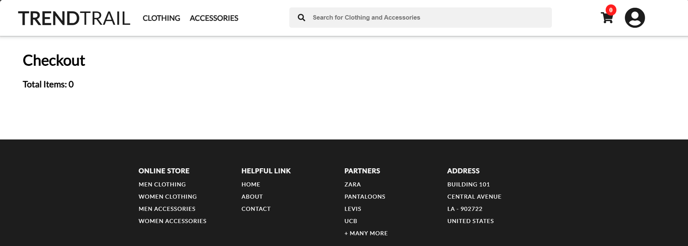

# E-Commerce Website

Welcome to the E-Commerce Website. This project is a simple implementation of an online platform for buying and selling products using HTML, CSS, and JavaScript.

## Table of Contents
- [Features](#features)
- [Screenshots](#screenshots)
- [Getting Started](#getting-started)
- [Contact](#contact)

## Features

- Responsive design for mobile and desktop.
- Product catalog with basic listing and details.
- Simple shopping cart functionality.
- Checkout process (simulated).
- Contact form for customer inquiries.

## Screenshots




## Getting Started

To get a local copy up and running, follow these steps:

1. Clone the repository:

   ```bash
   git clone https://github.com/Mehak1524/E-Commerce_Website.git
   ```

2. Navigate to the project directory:

   ```bash
   cd E-Commerce_Website
   ```

3. Open `index.html` in your web browser to view the application.

## Contact

You can reach out to me via email at [mehakverma2026@gmail.com](mailto:mehakverma2026@gmail.com).

